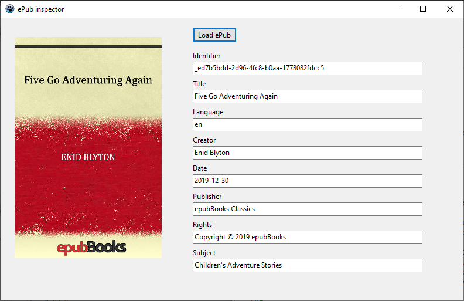

# fpc-epub
FreePascal/Lazarus unit for pulling metadata out of ePub files

## Use
1. Add `epub` to your uses clause
2. Initialize `epub := TEpubHandler.Create;`
3. Load an ePub file ` epub.loadFromFile('path/to/file');`
4. Extract data `epub.MetaData.title`

## Available Metadata
* identifier
* title
* language
* creator
* date
* publisher
* rights
* subject
* coverImage

## Example application
Source folder contains a Lazarus example project.

